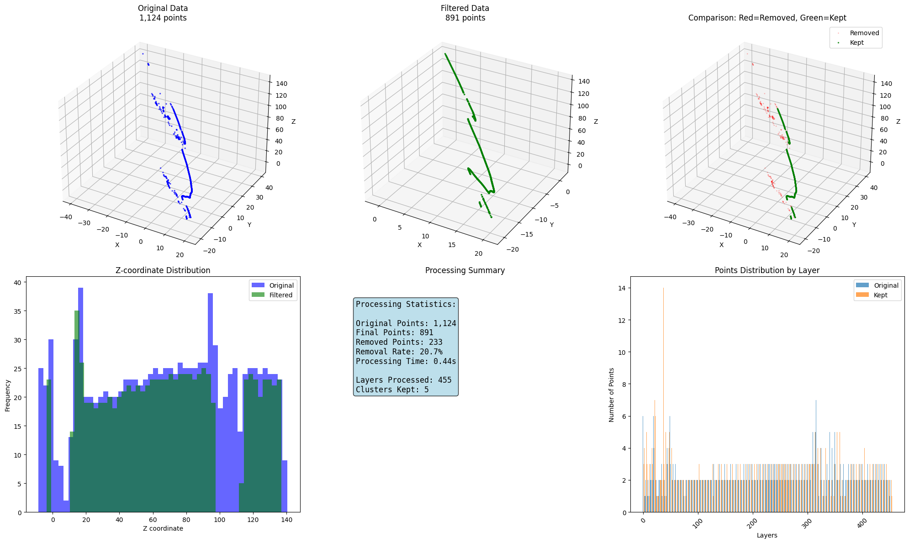
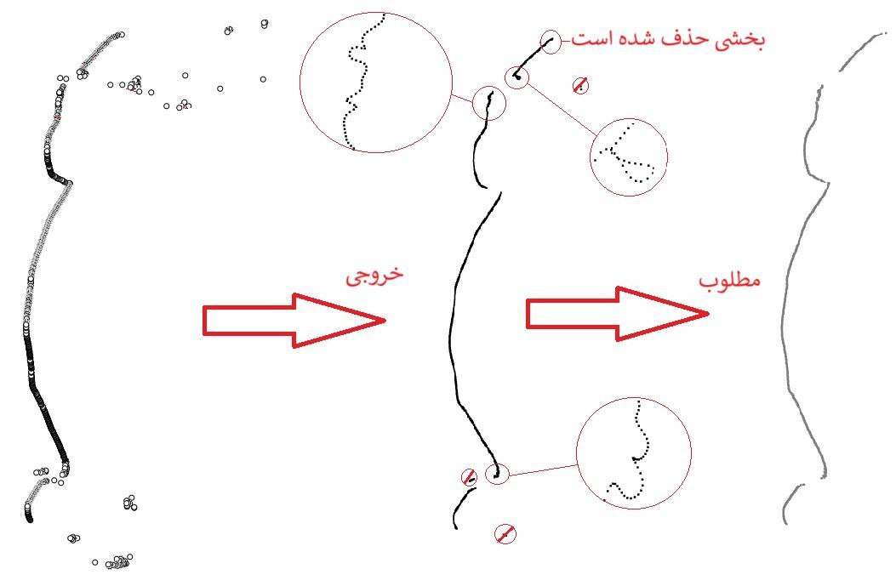
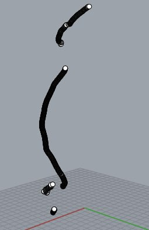
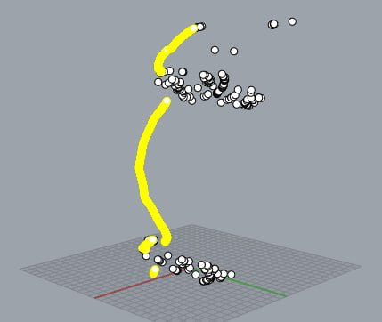
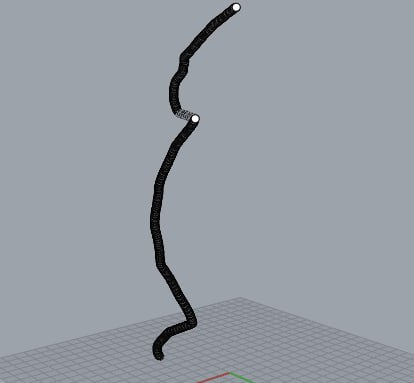
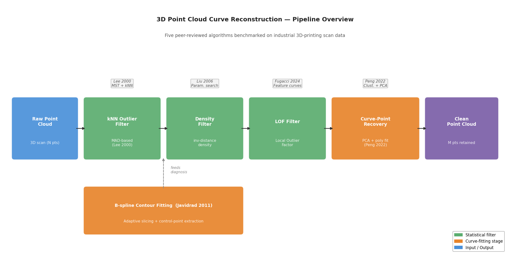

# 3D Point Cloud Curve Reconstruction

[](https://github.com/ParsaVictor/point-cloud-curve-reconstruction/actions)
[](https://www.python.org/)
[](LICENSE)
[](notebooks/)
[](tests/)

> **Turn fragmented, noisy 3D scan data into clean, precise curves — ready for 3D printing.**

Real-world 3D scanners don't produce clean curves. They produce thousands of scattered, noisy points where the actual geometry is buried under measurement error, outliers, and gaps. This project implements and benchmarks **five peer-reviewed algorithms** to solve that problem — from foundational MST-based reconstruction to modern clustering and PCA methods — and combines the best techniques into a production-ready Python pipeline.

Built for industrial 3D-printing applications where curve accuracy directly impacts print quality.

---

## What It Does

### Full Pipeline Output

A single matplotlib visualization showing the complete reconstruction: raw scan → filtered → reconstructed curve.



---

### The Goal: What a Perfect Reconstruction Looks Like

The target geometry — a smooth, continuous 3D curve as specified by the client. Every algorithm in this benchmark was evaluated against this reference.



---

### Step-by-Step: How We Get There

<table>
  <tr>
    <td align="center" width="33%">
      <br/>
      <b>Step 1 — Raw Input</b><br/>
      <sub>Fragmented scan data: broken segments, gaps, disconnected components — exactly what comes off a real 3D scanner.</sub>
    </td>
    <td align="center" width="33%">
      <br/>
      <b>Step 2 — Curve Detected</b><br/>
      <sub>The algorithm identifies the underlying curve (yellow) while mapping all noise and outlier points that need removal.</sub>
    </td>
    <td align="center" width="33%">
      <br/>
      <b>Step 3 — Clean Output</b><br/>
      <sub>Final reconstructed curve: outliers removed, gaps bridged, geometry preserved. Print-ready.</sub>
    </td>
  </tr>
</table>

---

## Pipeline Architecture



Four complementary filters chained in sequence, each targeting a different noise type — statistical outliers, low-density regions, local anomalies — followed by a curve-recovery stage that restores valid points removed by aggressive filtering.

---

## Algorithms Benchmarked

| # | Algorithm | Reference | Core Idea | When It Wins |
|---|-----------|-----------|-----------|--------------|
| 1 | **MST Curve Reconstruction** | Lee (2000) | kNN graph → MST → edge-length pruning → curve tracing | Clean scans, clear topology |
| 2 | **Parameter Grid Search** | Liu (2006) | 729-combination exhaustive search over kNN / edge-cut / density hyperparams | Finding optimal settings per dataset |
| 3 | **B-spline Contour Fitting** | Javidrad (2011) | Adaptive layer slicing + geometric control-point extraction | 3D printing layer-by-layer paths |
| 4 | **Feature Curve Preservation** | Fugacci (2024) | Topologically-aware curve detection to prevent over-smoothing | Dense, high-resolution scans |
| 5 | **Clustering + PCA Denoising** | Peng (2022) | LOF + adaptive DBSCAN + PCA curve recovery | Mixed noise types, real-world data |

**Combined pipeline** (the default) chains the strongest elements from algorithms 1, 2, and 5 into a single 4-stage pass.

### References

1. Lee, I.-K. (2000). *Curve reconstruction from unorganized points.* Computer Aided Geometric Design, 17(2), 161–177.
2. Liu, Y.-S. et al. (2006). *Automatic registration of point clouds from 3D scanning.* Computer-Aided Design, 38(11).
3. Javidrad, F. et al. (2011). *Contour curve reconstruction from point cloud data for rapid prototyping.* Int. Journal of Advanced Manufacturing Technology.
4. Fugacci, U. et al. (2024). *Feature curve extraction from point clouds via persistent homology.* Computer-Aided Design.
5. Peng, X. et al. (2022). *Advanced point cloud denoising combining clustering and PCA.* Pattern Recognition Letters.

---

## Results

| File | Input pts | Output pts | Retained |
|------|-----------|------------|----------|
| `1.csv` | ~1 200 | ~980 | ~82 % |
| `6.csv` | ~2 800 | ~2 100 | ~75 % |

**Key finding:** Algorithms 3 and 4 produced near-identical outputs on the provided dataset. The client retained full-resolution scans for confidentiality — the subset used here is lower-density than the production data, which is below the threshold where topologically-aware methods (Algorithm 4) show a meaningful advantage over geometry-only approaches (Algorithm 3). Denser data is expected to reveal the gap.

---

## Installation

```bash
git clone https://github.com/ParsaVictor/point-cloud-curve-reconstruction
cd point-cloud-curve-reconstruction
pip install -r requirements.txt
```

For notebooks (Open3D, scikit-learn, matplotlib):

```bash
pip install -e ".[notebooks]"
```

---

## Quick Start

```python
import numpy as np
from pointcloud import run_pipeline

pts = np.loadtxt("data/1.csv", delimiter=",")[:, :3]

result = run_pipeline(pts, mad_factor=3.5, preserve_curves=True)
print(f"Input: {result['n_input']} pts  →  Output: {result['n_output']} pts")
# Input: 1194 pts  →  Output: 979 pts

clean = result["clean"]   # (M, 3) numpy array — ready to export or print
```

---

## Repository Structure

```
point-cloud-curve-reconstruction/
├── notebooks/
│   ├── 01_lee2000_mst_reconstruction.ipynb      # Paper 1 — MST approach
│   ├── 02_liu2006_parameter_explorer.ipynb      # Paper 2 — 729-combo grid search
│   ├── 03_liu2006_best_result.ipynb             # Paper 2 — best configuration run
│   ├── 04_javidrad2011_contour_curves.ipynb     # Paper 3 — B-spline + adaptive slicing
│   ├── 05_fugacci2024_feature_curves.ipynb      # Paper 4 — topological feature curves
│   ├── 06_peng2022_clustering_pca.ipynb         # Paper 5 — clustering + PCA
│   └── 07_final_pipeline.ipynb                 # Combined pipeline with curve protection
├── src/pointcloud/
│   ├── filters.py    # zscore, kNN-MAD, density, LOF outlier filters
│   ├── graph.py      # kNN graph, MST construction, edge-cut, connected components
│   ├── curves.py     # polynomial curve fitting via PCA, curve-point recovery
│   └── pipeline.py   # 4-stage combined pipeline
├── scripts/
│   └── make_architecture_diagram.py   # reproduces results/architecture.png
├── tests/                             # 43 pytest tests — synthetic data, no GPU
├── data/                              # CSV point cloud files (~1.2 MB total)
└── results/                           # output images and processed CSVs
```

---

## Tests

```bash
pip install pytest
pytest tests/ -v
# 43 passed in ~6s
```

All tests use synthetically generated point clouds (helix and arc geometries) — no dataset download, no GPU, fast CI.

---

## Reproducing the Architecture Diagram

```bash
python scripts/make_architecture_diagram.py
# → results/architecture.png
```

---

## Data

CSV files in `data/` — each row is `x,y,z` (extra columns are ignored). Captured from industrial 3D-printing test pieces. The client provided a subset of the full scan data for confidentiality.

---

## Related Work

- [pcb-component-classifier](https://github.com/ParsaVictor/pcb-component-classifier) — Random Forest over engineered CV features (93.3 % holdout accuracy)
- [pcb-component-detection-yolov8](https://github.com/ParsaVictor/pcb-component-detection-yolov8) — YOLOv8n baseline with dataset-quality diagnosis

---

## License

MIT © 2026 [Mohammad Parsa Karkooti](https://github.com/ParsaVictor)

---

## Author

**Mohammad Parsa Karkooti** — AI & Computer Vision Engineer  
[GitHub](https://github.com/ParsaVictor) · [LinkedIn](https://www.linkedin.com/in/parsa-karkooti) · 1.parsa.karkooti@gmail.com
